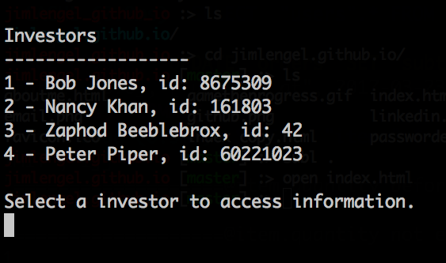

# Search Challenge

Write a program in Ruby that emulates a database. However, you will not be using a database. You will be given a file and you will need to search the file using familiar terms, such as 'find'.

## Goal 

Your program should be able to answer the following questions:

Can Bob Jones see the file named 'actual_notes.txt'?
What are the IDs of the investors who can see the file named 'super_secret_meeting_notes_jan.pdf'?

## Guidelines

Do not use a DB or an ORM.
Do not create a Rails project.
A testing framework is the only gem or outside code you may use.

Prove that it works with as mush testing as is necessary. If you are unfamiliar with unit tests, you may skip this step. Note Backstop does practice TDD/BDD so if you are brought on expect to learn about and write unit tests.

## Screen Shots

Your terminal does not have to look like this, but here are some guidelines:

